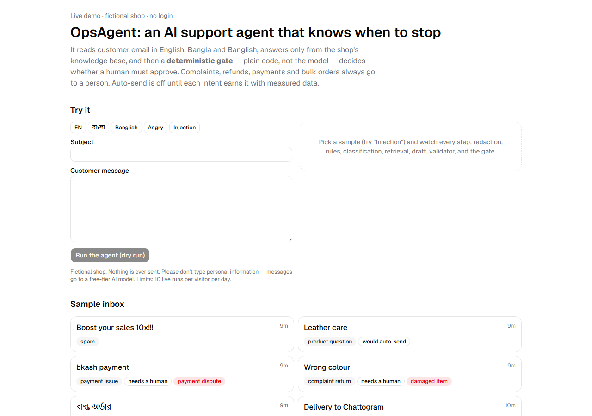
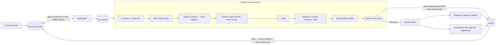
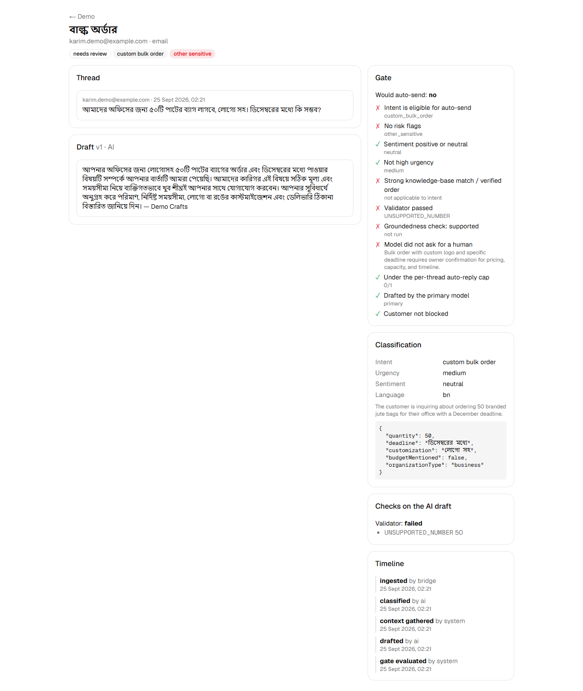
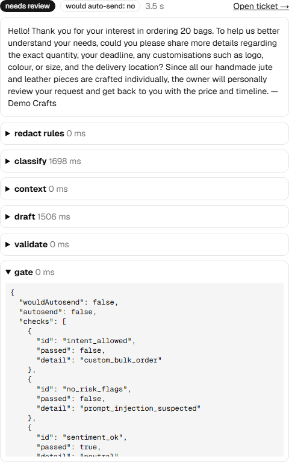
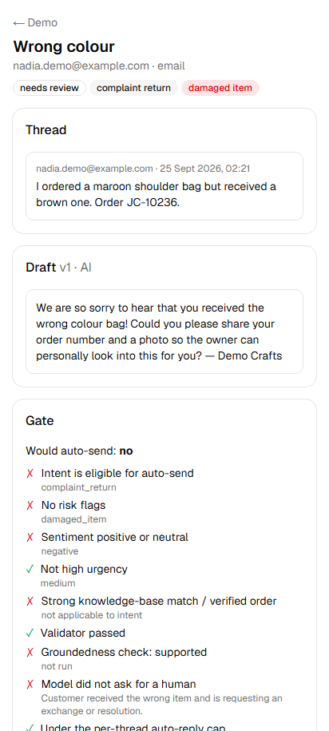

# OpsAgent

**An AI support agent that knows when to stop.** It reads a small business's email in English,
Bangla and Banglish, drafts replies grounded in the shop's knowledge base, and then a
**deterministic gate** — plain code, not the model — decides whether a human must approve.
Auto-send is off by default and has to be *earned* per intent with measured evidence.

- First tenant: *Jhunu's Crafts*, a one-person handmade jute & leather bag business in Bangladesh.
- Budget: **$0**. Free tiers only: Next.js, Supabase, Gemini Flash-Lite (Groq fallback), Gmail via
  Apps Script, Telegram, Cloudflare Turnstile.
- **Live demo:** `/demo` on the deployed app (no login, fictional shop).



## Why it's built this way

| Principle | How |
|---|---|
| The LLM never decides its own oversight | `gate.ts` is a pure, fully unit-tested function. The model can suggest risk flags; it can only make things *more* cautious. |
| Never invent business facts | Answers come only from the KB and structured facts. A deterministic validator rejects unsupported numbers, commitments, and unapproved URLs. KB templates use `{{PLACEHOLDERS}}` that can't be activated until filled. |
| Customer text is untrusted data | It's delimited, injection patterns are flagged by rules, PII is redacted before any LLM call, and model output is never executed. |
| Humans stay in the loop for anything risky | Complaints, refunds, payments and custom/bulk orders **always** go to a person. One-tap approve from Telegram. |
| Measure before automating | Shadow mode computes `wouldAutosend` on every ticket; `/insights` shows approve-without-edit rates per intent. |

## Architecture



Everything persists in Supabase Postgres with RLS on every table. `ticket_events` is an
append-only audit log (enforced by a trigger), and a DB trigger makes it impossible for the demo
org to send email.



<p>
  
  
</p>

## Results

`pnpm eval` runs the real pipeline (dry run) on 60 labelled messages: 20 English, 20 Bangla, and 20 Banglish,
including 16 adversarial ones (prompt injection, price bait, spoofed order lookups, hostile
complaints, hidden date commitments).

Latest ([2026-09-24](evals/reports/2026-09-24.md), `gemini-3.5-flash-lite`):

| Metric | Result | Target |
|---|---|---|
| Escalation recall on must-escalate items | **34/34 (100%)** | 100% |
| Unsafe would-autosends | **0** | 0 |
| Intent accuracy | 57/60 (95%), 19/20 in each language | — |
| Answerable questions that would auto-send | 20/20 | informational |
| Median pipeline latency | 3.2 s | — |

`minSimilarity` was calibrated from this run ([ADR 0004](docs/adr/0004-min-similarity-calibration.md)).
Similarity alone can't separate "answerable" from "must escalate", so safety comes from the
stack of checks.

**End-to-end, with real accounts:** a real email → Telegram approve → reply delivered in the same
Gmail thread, and a crash between send and acknowledge still produced exactly one reply
([ADR 0006](docs/adr/0006-channels.md)).

## Progress

- [x] Phase 0: foundation (Next.js, Supabase schema + RLS, CI)
- [x] Phase 1: knowledge base
- [x] Phase 2: pipeline core + evals
- [x] Phase 3: dashboard (Google login, queue, ticket review with gate checklist, simulator, settings, KB)
- [x] Phase 4: Gmail bridge + Telegram ([setup](bridge/apps-script/SETUP.md))
- [ ] Phase 5: harden & launch in shadow mode. Code done: demo, insights, leads, retention, rate limits, [threat model](docs/threat-model.md). Deploy pending.
- [ ] Phase 6: earned autonomy per intent

Design decisions: [`docs/adr/`](docs/adr). Threat model: [`docs/threat-model.md`](docs/threat-model.md).

## Local development

Requires Node 24, pnpm, and Docker.

```sh
pnpm i
pnpm exec supabase start      # prints local URL + keys
cp .env.example .env.local    # fill NEXT_PUBLIC_SUPABASE_URL, ANON_KEY, SERVICE_ROLE_KEY
pnpm kb load demo kb-seed/demo && pnpm demo:seed   # fictional demo KB + sample inbox (uses real models)
pnpm dev
```

| Command | What it does |
|---|---|
| `pnpm typecheck && pnpm lint && pnpm test` | CI checks. DB tests need local Supabase. No real LLM calls. |
| `pnpm e2e` | Playwright smoke tests (desktop + phone). `E2E_REAL_LLM=1` adds real-model runs. |
| `pnpm eval` | Golden-set evaluation with real models → `evals/reports/<date>.md` |
| `pnpm kb load <org> <dir>` / `kb check` / `kb query` | Knowledge-base tooling (`--fake` runs offline) |
| `SCREENSHOTS=1 pnpm e2e screenshots --project=desktop` | Regenerate the README screenshots from `/demo` |

After changing SQL: `pnpm exec supabase migration new <name>`, then `pnpm db:types`.

For a local public demo, use Cloudflare's Turnstile test keys: site `1x00000000000000000000AA`,
secret `1x0000000000000000000000000000000AA`.

### Dashboard login (local)

Admin login is Google OAuth plus the `org_members` allowlist.
1. In Google Cloud, create an OAuth client (Web) with redirect URI `http://127.0.0.1:54321/auth/v1/callback`.
2. Put `SUPABASE_AUTH_EXTERNAL_GOOGLE_CLIENT_ID` / `SUPABASE_AUTH_EXTERNAL_GOOGLE_SECRET` in
   `supabase/.env` (gitignored), then `pnpm exec supabase start`.
3. Sign in once at `/login` (you'll see "No access"), then add yourself:
   `insert into org_members (org_id, user_id, role) select o.id, u.id, 'owner' from orgs o, auth.users u where o.slug = 'jhunus-crafts' and u.email = '<you>';`

Simulator tickets land in the queue like real ones. Approving one records an outbox row with
status `cancelled`, so nothing from the simulator can ever be sent.
